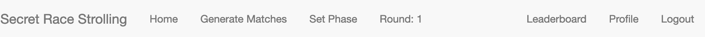

# spring22-TomDemont

Repository for Tom Demont semester project: Privacy Competition Platform for [SecretStroll](https://github.com/spring-epfl/CS-523-public/tree/master/secretstroll) project in CS-523.

## Introduction and purpose

In the last part of [SecretStroll](https://github.com/spring-epfl/CS-523-public/tree/master/secretstroll) project in CS-523 course, students are asked to test the limits of the system they built. To do so, they must simulate the execution of the software and collect the generated network trace. More information on the Secretstroll original system can be found in the [handout](https://github.com/spring-epfl/CS-523-public/blob/master/secretstroll/handout/handout_project_secretstroll.pdf) of the initial project. Here's a schematic representation of the final system: 

In this context, students are expected to use the collected trace to extract features and create a classifier that will learn how to associate tor network trace to a grid cell id queried for in the Secretstroll application.

It is possible, in the basic shape of the application, to obtain a very efficient and accurate classifier. Students must provide a reflection on issues and counter-measures to avoid the privacy leakage due to website fingerprinting. The current project takes place at this point: to extend Secretstroll, we aim to create a privacy competition platform where students could try different implementation and countermeasures, observe and measure the utility cost, and, afterward, attack other student's implementations to see the remaining accuracy of privacy attack machine learning based model.

This fulfils multiple pedagogical goals:

* Provide students utility measures for different implementations and see the utility/privacy trade-off interactively
* Give students matches with train and test sets to train a model and get meaningful performance metrics for the quality of their classifier against others' implementation
* Show students a taste of an interactive and live attack-defence based study of privacy preserving mechanisms' implementation
* Give to the course team an automated tool to observe and manage student's competition

This platforms aims to gather the interactive competition aspects of [Kaggle](https://www.kaggle.com/) or [AICrowd](https://www.aicrowd.com/) platforms, while adding the inter-students match aspect to multiply the variety of network traces to attack and evaluate on both the utility and privacy metrics to observe the necessary trade-off.

## Launch instructions

### Quick launch

```bash
git clone git@github.com:spring-epfl/spring22-TomDemont.git
cd spring22-TomDemont
```

In order to run this project, you need to have Python 3.9 installed. You are advised to create a virtual environment for this, to have a clean install of the requirements:

```bash
python3 -m venv venv
source venv/bin/activate
pip install -r requirements.txt
```

Finally, the next script starts (and installs in the folder if not already installed) the [Redis](https://redis.io/) message broker, starts the [Celery](https://docs.celeryq.dev/en/stable/index.html) distributed task queue and the Flask web server in development mode:

```bash
./run-srs.sh
```

After a few seconds, the server should be running on `http://localhost:5000`. All the processes can be stopped with a `Ctrl-C` SIGINT signal.

### Changing parameters

You can freely change the parameters of the application to adapt it to your needs. The modifiable environment variables are:

* `FLASK_ENV`: either development, testing or production. See [FLASK_ENV doc](https://flask.palletsprojects.com/en/2.1.x/config/#ENV)

For ease of use and avoid exporting this variable with `export FLASK_ENV=development`, this variable can be written in the `.flaskenv` file.

* `SECRET_KEY`: used to sign session cookies. See [SECRET_KEY doc](https://flask.palletsprojects.com/en/2.1.x/config/#SECRET_KEY)
* `DATABASE_URL`: the URL of the used Database. See [SQLALCHEMY_DATABASE_URI doc](https://flask-sqlalchemy.palletsprojects.com/en/2.x/config/#configuration-keys)
* `MAIL_SERVER` and `MAIL_PORT`: the server and port to use for outgoing mail support.
* `MAIL_USE_TLS`: whether the outgoing mail should be sent using STARTTLS. True if the variable is set to anything.
* `MAIL_USE_SSL`: whether the outgoing mail should be sent using SSL. True if the variable is set to anything.
* `MAIL_USERNAME` and `MAIL_PASSWORD`: credentials to use for connection to the mail server.
* `ADMIN`: the admin mail address for sending logging errors
* `MAIL_DEFAULT_SENDER`: the mail sender for mail support
* `MAIL_TEST_RECEIVER_FORMAT`: a Python format string for an email address using [plussed addressed email](https://bitwarden.com/help/generator/#username-types). Only used for development and user generation, to test receive student user email addresses.
* `MATCHES_PER_TEAM`: determines how many matches each team will be assigned at every round (should be less than the number of teams - 1)
* `MATCHES_PER_PAGE`: determines the number of matches to display on the `/index` page
* `MAX_CONTENT_LENGTH`: the maximum number of **mega** bytes any uploaded archives should not exceed.
* `UPLOAD_FOLDER` and `TEMPORARY_UPLOAD_FOLDER`: the name of the folders to save students files to (expected to already be created)
* `NB_CLASSES`: the number of possible classes the students are expected to make classification for (the number of grid cell id for Secretstroll).
* `DEFENCE_COLUMNS`: a string with the comma separated column names the uploaded network traces should have.
* `ATTACK_COLUMNS`: a string with the comma separated column names the uploaded trace classification should have. Will be appended with `proba_class_i` for `i` in `{1..NB_CASSES}` to hold the probability classification that should output the classifier.
* `CELERY_BROKER_URL` and `RESULT_BACKEND`: URLs of the message broker and result backend to use. Initially works with Redis.
* `NB_TRACES_TO_CLASSIFY`: the number of traces students should make a classification for, the size of the test set.
* `MEAN_NB_REP_PER_CLASS`: the expected mean amount of network traces to collect per grid cell id query in the Secretstroll system. Corresponds to the number of times the script `attack_defence_test_scripts/capture.sh` should be run by a student.
* `DEVIATION_NB_REP_PER_CLASS`: the accepted number of amount of traces traces per grid cell id deviating from the mean. Captures being difficult and not always perfect, students having `MEAN_NB_REP_PER_CLASS`±`DEVIATION_NB_REP_PER_CLASS` network traces for the capture on grid cell id `i` have capture accepted by the system.
* `ROWS_PER_CAPTURE`: the minimum number of rows the file holding network trace capture should have for each capture. Can be seen as the minimum number of packets we require to accept a network trace as valid.
* `LEADERBOARD_CACHE_TIME`: the number of seconds we should cache the leader-board.

For ease of use and avoid exporting this variable with `export ADMIN="cs-523@groupes.epfl.ch"`, these variables can be written in the `.env` file, that will be loaded with the python [`dotenv`](https://pypi.org/project/python-dotenv/) module. All those variables have reasonable default value that should allow the system to run correctly.

## User (student) guide

Student should first create an account on the `http://127.0.0.1:5000/register` page. They can select a team among the already existing ones or create a new one. They won't be able to change their team later. Once done, they can login and reach all the website's content.

* They can navigate through pages with the upper navigation bar. We'll see the available menus from left to right.
* In the home page `http://127.0.0.1:5000/index`, they can see, when available, the matches that should be done once those will be generated. 
* The `Round: 1` indicates the current round students are in. See [Timeline](#timeline).
* The leaderboard page allow students to see their score and ranking 
* The profile page gives access to either, the user information if they have no team, or the team's information. 
* When made available by the admin, users will see an `Upload Defence` button on the top of each page. Students will there have a file upload form where they can send their compressed csv containing the dataframe of their capture in the correct format .
* When made available by the admin, students will see an `Attack` button on the top of each page. . There will there be 2 possible actions:
  * `Download attack`, where they will get a zip file containing zip files for each train set and test set they should provide a classification
  * Another file upload form where they should be able to upload their classification for the test sets they should've attacked
* For both attack and defence, see [Testing and toy example](#testing-and-toy-examples) part to learn how to play with these.

## User (admin) guide

The admin account should be created directly on the server side. This can be done with:

```bash
flask shell
```

Which launch the Python3 command line interpreter with the flask context already imported.

```python
admin = User(username="admin", email=app.config["MAIL_TEST_RECEIVER_FORMAT"].format("admin"), sciper=1000, is_admin=True)
db.session.add(admin)
db.session.commit()
admin.set_password("put-the-admin-password")
```

Adds an admin named `admin` and password `put-the-admin-password`. This user can log in as a student user would do. This admin has an augmented navigation bar with 2 more menus: 

* Generate Matches brings to the guide page for generating the matches for a new round. Once the GET request is made, the matches are pushed to the database and students can see those on the home page. Note that currently, the leaderboard is only round-wise: when going to the next round, the leaderboard will be reset (the data is not erased from the database though).

* Set Phase allows to change the phase between "attack", "defence", none or both. When reaching the Set Phase page, automatically the phase is set to none: no student can upload attack or defence.


## Testing and toy examples

In order to have an experience of the running of the competition, the scripts in [`db_scripts.py`](db_scripts.py) and in the folder [`attack_defence_test_scripts`](attack_defence_test_scripts) provides scripts, data and code snippets to test the platform.

### Test db population

The following commands allow to properly flush all the database data and populate 10 fake users in 5 different teams, all with password `admin`. ⚠️ This can't be reverted, use with care:

```bash
flask shell
```

Launches the python CLI with the app context.

```python
populate_test_users()
```

### Test defence upload

The file `attack_defence_test_scripts/test_defence.csv.zip` contains a csv file in the correct format and is ready to be uploaded as is in the upload defence form. The csv file has the following shape 

You can try to log in as one of the fake user (`alice` for example) upload it and receive the success email if you configured the `MAIL_TEST_RECEIVER_FORMAT` variable as described in [launch instructions](#changing-parameters) to `your.email+{}@yourdomain.tld`. Feel free to change this file and test the failing conditions. The file can be loaded with pandas with `pandas.read_csv("attack_defence_test_scripts/test_defence.csv.zip")` (that will automatically uncompress the file).

### Test attack upload

Once every fake user uploaded a test_defence_set (the same can be used multiple times, it will be split differently), you can login as any non-admin user and start attack. To do so, you can click the `Download attack` button as described in [user (student) guide](#user-student-guide), save the file and uncompress it and put all the zip file inside the archive into the folder [`attack_defence_test_scripts`](attack_defence_test_scripts).

The script [`fingerprint.py`](attack_defence_test_scripts/fingerprinting.py) can read the provided files and output a classification of the test set in the desired compressed csv format.

```bash
# usage
python3 fingerprint.py "[int id of the first to attack]" "[int id of the second to attack]" "..."
```

example, if the folder contains train and test files for `team_1`, `team_4` and `team_5`:

```bash
python3 fingerprint.py 1 4 5
```

This will create a file named `my_classification.csv.zip` that can be uploaded to the attack upload form. As in [Test defence upload](#test-defence-upload), you can receive the confirmation email and see your results on the team page.

## Software architecture

### Timeline

### Data model

### Code hierarchy

<!-- ## Timeline

The software is developed following the idea of the timeline described in 

## Data model

The database model can be found under `srs_model.xml` and can be visualized on the tool [https://ondras.zarovi.cz/sql/demo/](https://ondras.zarovi.cz/sql/demo/).


## Run instructions

### Setup of virtual environment

Once in the cloned folder, I suggest you create a python virtual environment for this project:

```zsh
python3 -m venv venv
source venv/bin/activate
pip install -r requirements.txt
```

### Running the server

Most environment variables should be set in the `.flaskenv` file. If you don't want to use it or have undeclared environment variable, export those in your environment before running e.g.:

```zsh
export FLASK_APP=srs.py
```

Then run the server with:

```zsh
flask run
```

Run Redis message broker with

```zsh
./run-redis.sh
```

Run Celery worker with

```zsh
celery -A app.celery worker --loglevel=info
``` -->

## Credits

The Flask app is created following the useful and very detailed guides from [Miguel Grinberg](https://blog.miguelgrinberg.com/post/the-flask-mega-tutorial-part-i-hello-world)
