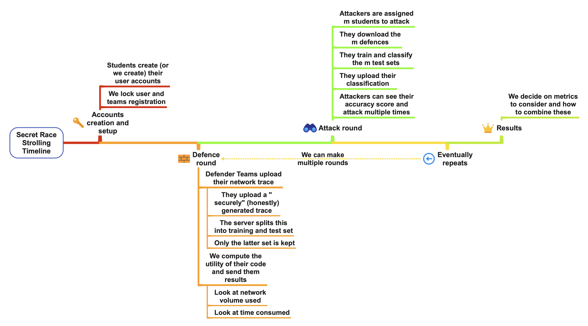

# spring22-TomDemont

Repository for Tom Demont semester project: Privacy Competition Platform for [SecretStroll](https://github.com/spring-epfl/CS-523-public/tree/master/secretstroll) project in CS-523.

## Introduction and purpose

In the last part of [SecretStroll](https://github.com/spring-epfl/CS-523-public/tree/master/secretstroll) project in CS-523 course, students are asked to test the limits of the system they built. To do so, they must simulate the execution of the software and collect the generated network trace. More information on the Secretstroll original system can be found in the [handout](https://github.com/spring-epfl/CS-523-public/blob/master/secretstroll/handout/handout_project_secretstroll.pdf) of the initial project. Here's a schematic representation of the final system: 

In this context, students are expected to use the collected trace to extract features and create a classifier that will learn how to associate tor network trace to a grid cell id queried for in the Secretstroll application.

It is possible, in the initial version of the application, to obtain a very efficient and accurate classifier. Students must provide a reflection on issues and counter-measures to avoid the privacy leakage due to website fingerprinting. The current project takes place at this point: to extend Secretstroll, we aim to create a privacy competition platform where students could try different implementation and countermeasures, observe and measure the utility cost, and, afterward, attack other student's implementations to see the remaining privacy leakage after machine learning based attacks.

This fulfils multiple pedagogical goals:

* Provides students utility measures for different implementations and observe the utility/privacy trade-off interactively
* Assign matches to students with train and test sets to train a model and get meaningful performance metrics for the quality of their classifier against other implementations
* Give students a taste of an interactive and live attack-defence based study of privacy preserving mechanism implementations
* Provide to the course team with an automated tool to observe and manage student's competition

This platforms aims to gather the interactive competition aspects of [Kaggle](https://www.kaggle.com/) or [AICrowd](https://www.aicrowd.com/) platforms, while adding the inter-students match aspect to multiply the variety of network traces to attack and evaluate on both the utility and privacy metrics to observe the trade-off inherent to PETs.

In order to allow development on top of this project, here's a quick description of some aspects of the architecture of the software.

### Timeline

The software is developed following the idea of the timeline depicted as follows:

Note that the multiple round feature has not been included in the score computation: the current implementation considers each round to be independent and resets the leaderboard between each round. However it's totally possible to augment this and consider aggregation of multiple round scores for the total score computation. The main modification that should be done is the implementation of a scoring aggregation for multiple rounds in [`app/routes.py`](app/routes.py) and [`app/models.py`](app/models.py).

This timeline suggests that we separate strictly the attack and defence phases. Indeed, the software could support both being available at the same time, but our consideration of the pedagogical impact lead us to think that this could overwhelm students. Therefore, splitting both phases allows to focus on the improvement and implementation of the specific part. Students will be able to clearly see both aspects evolving one after the other, earning points with good utility score but taking care of not being "too easy to attack", and leading to giving "privacy leakage" points to adversaries.

### Data model

The database model can be found under `srs_model.xml` and can be visualized on the tool [https://ondras.zarovi.cz/sql/demo/](https://ondras.zarovi.cz/sql/demo/).


This describes the current relational model between the entities defined with [SQLAlchemy](https://www.sqlalchemy.org/) ORM module in the [`app/models.py`](app/models.py) file. This model allows us to follow the constructive structure of the software's entities: we create user, belonging to team, uploading their Defence. After that, we assign matches where we'll produce eventually many instances of attacks per match, in order to maximize the score obtained in the match.

### Code hierarchy

The hierarchy of this code follows the standard hierarchy of Flask application, without the need for Blueprint patterns. Here's a quick description of the different files and their purposes:

* [`srs.py`](srs.py): the application's location, loaded with the command `flask run`
* [`test.py`](test.py): the unit tests for the application
* [`config.py`](config.py): the `Config` object, passed at app module initialization
* [`db_scripts.py`](db_scripts.py): the scripts used for flushing db and putting test users. See [Testing and toy examples](#testing-and-toy-examples)
* [`run-redis.sh`](run-redis.sh): scripts dealing with installation and running of Redis message broker
* [`run-srs.sh`](run-srs.sh): launch script. See [Launch instructions](#launch-instructions)
* [`app.db`](app.db): the sqlite database file holding the database
* [`.flaskenv`](.flaskenv): file holding Flask related environment variables. See [Changing parameters](#changing-parameters)
* [`migrations`](migrations): folder created at database initialization. [This post](https://blog.miguelgrinberg.com/post/the-flask-mega-tutorial-part-iv-database) is helpful to understand its purpose and how to initialize/migrate the database.
* [`logs`](logs): holds the logs created by the app
* [`attack_defence_test_scripts`](attack_defence_test_scripts): contains scripts to test the functioning of system in real conditions. See [Testing and toy examples](#testing-and-toy-examples)
  * [`attack_defence_test_scripts/capture.sh`](attack_defence_test_scripts/capture.sh): shell script managing the capture of network trace in the Secretstroll client container. Captures once the queries on each grid cell
  * [`attack_defence_test_scripts/fingerprinting.py`](attack_defence_test_scripts/fingerprinting.py): python script using a Random Forest classifier to determine the grid cell hidden behind the features of some test set vectors
  * [`attack_defence_test_scripts/test_defence.csv.zip`](attack_defence_test_scripts/test_defence.csv.zip): compressed csv file containing the capture data in the correct format for being uploaded as defence trace
* [`app`](app): the module containing all the app system
  * [`app/__init__.py`](app/__init__.py): initializes the app module and all the flask extension modules it uses
  * [`app/routes.py`](app/routes.py): main router for the application. Entrypoint for all the HTTP queries made to the server
  * [`app/models.py`](app/models.py): creation with SQLAlchemy of the object relational model for the application's entities, along with the creation of database interaction functions
  * [`app/forms.py`](app/forms.py): creation of the web forms with Flask WTForm module
  * [`app/errors.py`](app/errors.py): handlers of HTTP errors for Flask app
  * [`app/cached_items.py`](app/cached_items.py): contains the objects used for caching (currently, only the leaderboard items in order to prevent triggering re-computation)
  * [`app/tasks_control.py`](app/tasks_control.py): contains the celery tasks for handling control message, currently, email sending
  * [`app/tasks_defence.py`](app/tasks_defence.py): contains the celery tasks for handling the student's upload of defence trace
  * [`app/tasks_attack.py`](app/tasks_attack.py): contains the celery tasks for handling the student's upload of attack classification
  * [`app/templates`](app/templates/): contains the HTML templates rendered with the flask Jinja engine.
  * [`app/uploads`](app/uploads/) and [`app/temp_uploads`](app/temp_uploads/): contains the files uploaded by students. `uploads` aims to keep the train, test and verification sets for the whole competition. `temp_uploads` only holds the raw uploaded files in order to let the celery workers have access to it and perform their tasks. No file should be kept after the tasks

## Launch instructions

### Quick launch

First, install the project:

```bash
git clone git@github.com:spring-epfl/spring22-TomDemont.git
cd spring22-TomDemont
```

In order to run this project, you need to have Python 3.9 installed. You are advised to create a virtual environment for this, in order to have a clean install of the requirements:

```bash
python3 -m venv venv
source venv/bin/activate
pip install -r requirements.txt
```

Mail support is an important part of the feedback given on uploaded files by students. In order to benefit from these, you can set the following environment variable this way (see [changing parameters](#changing-parameters) for more details), change the parameters between `[]` to yours for a config with EPFL email:

```bash
echo -e 'MAIL_SERVER="mail.epfl.ch"\nMAIL_PORT=465\nMAIL_USE_SSL=True\nMAIL_USERNAME="[gaspar-username]"\nMAIL_PASSWORD="[gaspar-password]"\nMAIL_DEFAULT_SENDER="[your_first_name.your_family_name]@epfl.ch"\nMAIL_TEST_RECEIVER_FORMAT="[your_first_name.your_family_name]+{}@epfl.ch"' > .env
```

Finally, the next script starts (and installs in the folder `redis-stable` if not already installed) the [Redis](https://redis.io/) message broker, starts the [Celery](https://docs.celeryq.dev/en/stable/index.html) distributed task queue and the Flask web server in development mode:

```bash
./run-srs.sh
```

After a few seconds, the server should be running on `http://localhost:5000`. All the processes can be stopped with a `Ctrl-C` SIGINT signal.

### Changing parameters

You can freely change the parameters of the application to adapt it to your needs. We sorted those by categories. In order to avoid having to export manually all these variables with `export FLASK_ENV=development`, you can create 2 files:

* `.flaskenv`: contains the public environment variables like `FLASK_ENV`. Should be versioned.
* `.env`: contains all the other environment variables. Should not be versioned and kept private.

Writing your environment variables there will let them be loaded with the python [`dotenv`](https://pypi.org/project/python-dotenv/) module and you won't have to export them on every Shell session. See [flask environment variables documentation](https://flask.palletsprojects.com/en/2.1.x/cli/#environment-variables-from-dotenv). In order to fully run the application, you only have to set your mail parameters in the `.env` file, see [quick launch](#quick-launch).

#### Technical parameters

* `FLASK_ENV`: either development, testing or production. See [FLASK_ENV doc](https://flask.palletsprojects.com/en/2.1.x/config/#ENV)
* `SECRET_KEY`: used to sign session cookies. See [SECRET_KEY doc](https://flask.palletsprojects.com/en/2.1.x/config/#SECRET_KEY)
* `DATABASE_URL`: the URL of the Database. See [SQLALCHEMY_DATABASE_URI doc](https://flask-sqlalchemy.palletsprojects.com/en/2.x/config/#configuration-keys)
* `CELERY_BROKER_URL` and `RESULT_BACKEND`: URLs of the message broker and result backend to use. Initially works with Redis.
* `UPLOAD_FOLDER` and `TEMPORARY_UPLOAD_FOLDER`: the names of the folders to save students files to.

#### Mail support parameters

* `MAIL_SERVER` and `MAIL_PORT`: the server and port to use for outgoing email support.
* `MAIL_USE_TLS`: whether the outgoing email should be sent using STARTTLS. True if the variable is set to anything non-empty.
* `MAIL_USE_SSL`: whether the outgoing email should be sent using SSL. True if the variable is set to anything non-empty.
* `MAIL_USERNAME` and `MAIL_PASSWORD`: credentials to use for connection to the email server.
* `ADMIN`: the admin email address for sending logging errors
* `MAIL_DEFAULT_SENDER`: the email sender for email support. See [Flask-Mail](https://pythonhosted.org/Flask-Mail/#configuring-flask-mail)
* `MAIL_TEST_RECEIVER_FORMAT`: a Python format string for an email address using [plussed addressed email](https://bitwarden.com/help/generator/#username-types). Only used for development and user generation, to test receive student user email addresses.

#### Appearance

* `MATCHES_PER_PAGE`: determines the number of matches to display on the `/index` page

#### Competition design

* `MATCHES_PER_TEAM`: determines how many matches each team will be assigned at every round (should be strictly less than the number of teams)
* `NB_CLASSES`: the number of possible classes the students are expected to make classifications for (the number of grid cells for Secretstroll).
* `NB_TRACES_TO_CLASSIFY`: the number of traces students should make a classification for, the size of the test set.

#### Trace verification

* `MAX_CONTENT_LENGTH`: the maximum number of **mega** bytes any uploaded archives should not exceed.
* `MEAN_NB_REP_PER_CLASS`: the expected mean amount of network traces to collect per grid cell id query in the Secretstroll system. Corresponds to the number of times the script `attack_defence_test_scripts/capture.sh` should be run by a student.
* `DEVIATION_NB_REP_PER_CLASS`: the accepted number of amount of traces traces per grid cell id deviating from the mean. Captures being difficult and not always perfect, students having `MEAN_NB_REP_PER_CLASS`±`DEVIATION_NB_REP_PER_CLASS` network traces for the capture on grid cell id `i` have capture accepted by the system.
* `ROWS_PER_CAPTURE`: the minimum number of rows the file holding network trace capture should have for each capture. Can be seen as the minimum number of packets we require to accept a network trace as valid.

#### Leaderboard

* `LEADERBOARD_CACHE_TIME`: the number of seconds we should cache the leader-board.

#### Data formats

* `DEFENCE_COLUMNS`: a string with the comma separated column names the uploaded network traces should have.
* `ATTACK_COLUMNS`: a string with the comma separated column names the uploaded trace classification should have. Will be appended with `proba_class_i` for `i` in `{1..NB_CASSES}` to hold the probability classification that should output the classifier.

## User (student) guide

Students should first create an account on the `http://127.0.0.1:5000/register` page. They can select a team among the already existing ones or create a new one. They won't be able to change their team later. Once done, they can login and reach all the website's content.

* They can navigate through pages with the upper navigation bar. We'll see the available menus from left to right.
* In the home page `http://127.0.0.1:5000/index`, they can see, when available, the matches assigned to them once generated. 
* The `Round: 1` indicates the current round students are in. See [Timeline](#timeline).
* The leaderboard page allow students to see their score and ranking 
* The profile page gives access to either, the user information if they have no team, or the team's information. 
* When made available by the admin, users will see an `Upload Defence` button on the top of each page. Students will there have a file upload form where they can send their compressed csv containing the dataframe of their capture in the correct format. 
* When made available by the admin, students will see an `Attack` button on the top of each page. . There will there be 2 possible actions:
  * `Download attack`, where they will get a zip file containing zip files for each train set and test set they should provide a classification for
  * Another file upload form where they should be able to upload their classification for the test sets they attacked
* For both attack and defence, see [Testing and toy example](#testing-and-toy-examples) part to learn how to play with these.

## User (admin) guide

If you use the script described in [test db population](#test-db-population), you will already have an admin account named `admin` with password `admin`. Otherwise, the admin account should be created directly on the server side. This can be done with:

```bash
flask shell
```

Which launch the Python3 command line interpreter with the flask context already imported.

```python
admin = User(username="admin", email=app.config["MAIL_TEST_RECEIVER_FORMAT"].format("admin"), sciper=1000, is_admin=True)
db.session.add(admin)
db.session.commit()
admin.set_password("put-the-admin-password")
```

Adds an admin named `admin` and password `put-the-admin-password`. This user can log in as a student user would do. This admin has an augmented navigation bar with 2 more menus: 

* Generate Matches brings to the guide page for generating the matches for a new round. Once the GET request is made, the matches are pushed to the database and students can see those on the home page. Note that currently, the leaderboard is only round-wise: when going to the next round, the leaderboard will be reset (the data is not erased from the database though).

* Set Phase allows to change the phase between "attack", "defence", none or both. When reaching the Set Phase page, the phase is automatically set to `"None"`: no student can upload attack or defence, to have a buffer state and avoid having inconsistencies.


## Testing and toy examples

In order to have an experience of the running of the competition, the scripts in [`db_scripts.py`](db_scripts.py) and in the folder [`attack_defence_test_scripts`](attack_defence_test_scripts) provides scripts, data and code snippets to test the platform. Unit tests are also available to test the model entities and functions, those can be run with:

```bash
python3 test.py
```

### Test db population

The following commands allow to properly flush all the database data and populate 10 fake users in 5 different teams plus and admin user named `admin` (in no team), all with password `admin`. ⚠️ This can't be reverted, use with care:

```bash
flask shell
```

Launches the python CLI with the app context.

```python
populate_test_users()
```

### Test defence upload

The file `attack_defence_test_scripts/test_defence.csv.zip` contains a csv file in the correct format and is ready to be uploaded as is in the upload defence form. The csv file has the following shape 

You can try to log in as one of the fake user (`alice` for example) upload it and receive the success email if you configured the `MAIL_TEST_RECEIVER_FORMAT` variable as described in [launch instructions](#changing-parameters) to `your.email+{}@yourdomain.tld`. Feel free to change this file and test the failing conditions. The file can be loaded with pandas with `pandas.read_csv("attack_defence_test_scripts/test_defence.csv.zip")` (that will automatically uncompress the file).

### Test attack upload

Once every fake user uploaded a test_defence_set (the same can be used multiple times, it will be split differently), you can login as any non-admin user and start attack. To do so, you can click the `Download attack` button as described in [user (student) guide](#user-student-guide), save the file, uncompress it and put all the zip file inside the archive into the folder [`attack_defence_test_scripts`](attack_defence_test_scripts).

The script [`fingerprint.py`](attack_defence_test_scripts/fingerprinting.py) can read the provided files and output a classification of the test set in the desired compressed csv format.

```bash
# usage
python3 fingerprint.py "[int id of the first to attack]" "[int id of the second to attack]" "..."
```

example, if the folder contains train and test files for `team_1`, `team_4` and `team_5`:

```bash
python3 fingerprint.py 1 4 5
```

This will create a file named `my_classification.csv.zip` that can be uploaded to the attack upload form. As in [Test defence upload](#test-defence-upload), you can receive the confirmation email and see your results on the team page.

## Credits

The Flask app is created following the useful and very detailed guides from [Miguel Grinberg](https://blog.miguelgrinberg.com/post/the-flask-mega-tutorial-part-i-hello-world)
